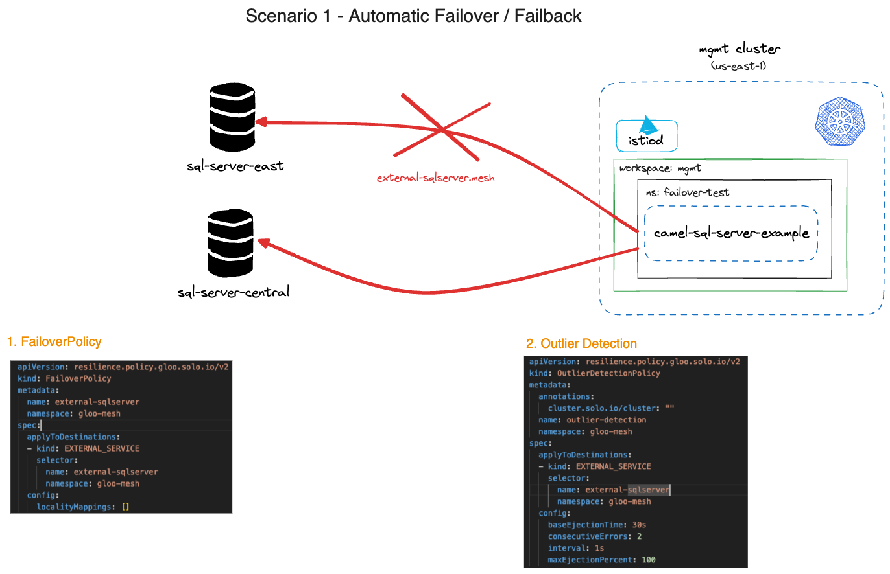

SQL Server failover / failback with Gloo Mesh
==========================================

This example demonstrates how to use SprinBoot to call a active/active SQL Server cluster.  It demonstrates the use of Gloo Mesh to accommodate failover / failback of the SQL Server JDBC connection.  This can be deployed to any flavor of Kubernetes, in this case, GKE.

## Prerequisites

1. Java 11+
2. Maven 3.8+
3. A running GKE instace

## Build

You can build this example using

```
    mvn package
```

## Run the example

Using the shell:

 1. Start the springboot service:

```
  $ mvn spring-boot:run
```
    
## Deploying to Kubernetes

To deploy to GKE, we need to follow these steps.

## Prerequisites

1. Java 11+
2. Docker
3. DockerHub account
4. A GKE account, with
5. gcloud CLI
6. kubectl

## Method

1. Via the CLI (`/camel-sql-server-example` directory), run the following commands to build the Docker image locally:

```bash
docker login
mvn package
mvn clean spring-boot:build-image
```

2. Login to your public DockerHub repo (using the push commands popup), then tag the docker image and push it to the the repo using your correct repo ID:

```bash
docker tag docker.io/library/camel-sql-server-example:1.0.2 simongreen02/camel-sql-server-example:1.0.2
docker push simongreen02/camel-sql-server-example:1.0.2
```
3. Update the repo ID in `src/k8s/deployment.yaml` to point to the correct ECR repo:

```yaml
    spec:
      containers:
      - image: simongreen02/camel-sql-server-example:1.0.2
        name: camel-sql-server-example
        resources: {}
status: {}
```

4. Deploy the image and service to gke:

```bash
kubectl apply -f src/k8s/deployment.yaml -n failover-test
```

5.   Apply the Gloo Mesh policies

```bash
kubectl apply -f mesh/external-service.yaml -n gloo-mesh
```


